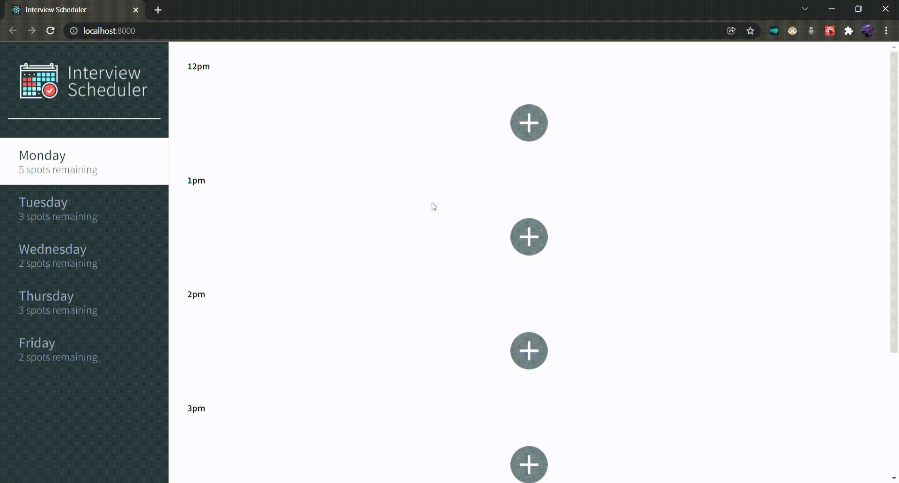
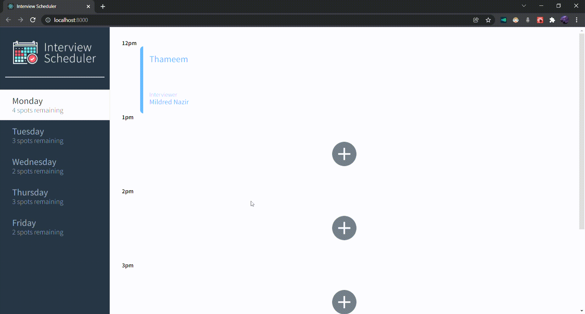
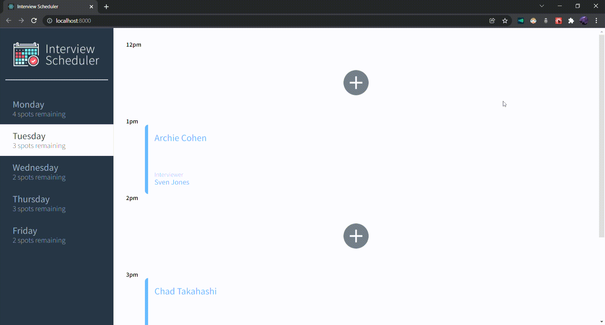

# Interview Scheduler

## Description

Interview Scheduler is a single-page application (SPA) that allows users to book, edit and cancel interviews between students and interviewers. The front end of this project is built with React framework and data is persisted by API server using Postgre SQL database. Jest tests are used through the development of the project. End-to-End testing is done with Cypress.

## Requirements

1. Interviews can be booked between Monday and Friday.
2. A user can switch between weekdays.
3. A user can book an interview in an empty appointment slot.
4. Interviews are booked by typing in a student name and clicking on an interviewer from a list of available interviewers.
5. A user can cancel an existing interview.
6. A user can edit the details of an existing interview.
7. The list of days informs the user how many slots are available for each day.
8. The expected day updates the number of spots available when an interview is booked or canceled.
9. A user is presented with a confirmation when they attempt to cancel an interview.
10. A user is shown an error if an interview cannot be saved or deleted.
11. When the user presses the close button of the error they are returned to the Form or Show view (skipping Status and Confirm).
12. The application makes API requests to load and persist data. We do not lose data after a browser refresh.

## Product

Users are able to select different day


Users can book an interview



Users can edit an interview



Users can delete an interview


Error Message



## Tech Stack

1. PostgreSQL
2. ExpressJS
3. React framework
4. NodeJS
5. Sass
6. Jest
7. Cypress

## server-side application

[scheduler-api](https://github.com/thameemsh/scheduler-api)

## Dependencies

- axios
- classnames
- normalize.css
- react
- react-dom
- react-scripts

## Dev Dependencies

- @babel/core
- storybook
- cypress
- node-sass
- prop-types
- react-test-renderer

## Setup

Install dependencies with `npm install`.

## Running Webpack Development Server

```sh
npm start
```

## Running Jest Test Framework

```sh
npm test
```

## Running Storybook Visual Testbed

```sh
npm run storybook
```
